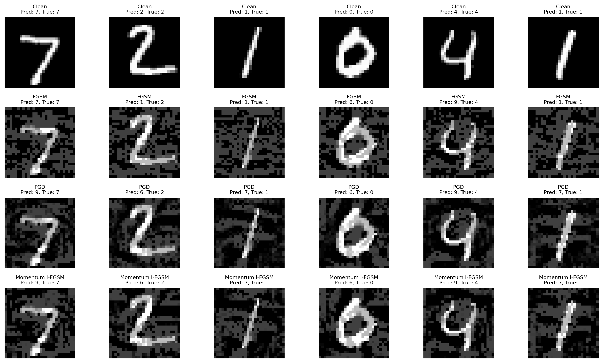
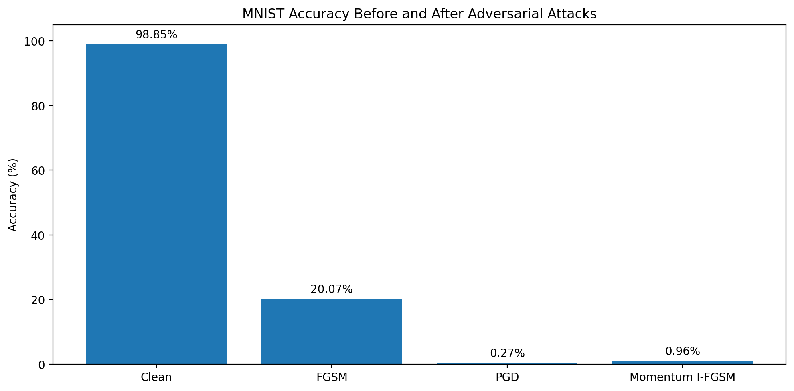

# MNIST Adversarial Attack

## Problem

This project trains a CNN model on the MNIST handwritten digit dataset and then attacks the trained model using adversarial examples.

The goal is to compare the recognition rate before attacks and the attack success rate after attacks.

## Dataset

The dataset is MNIST.

- Training set: 60,000 images
- Test set: 10,000 images
- Image size: 1 x 28 x 28
- Classes: digits 0 to 9

The model is trained on the training set and tested on the test set.

## Model

I used a Convolutional Neural Network (CNN) for MNIST digit recognition.

The CNN includes:

- Two convolution layers
- Max pooling
- Fully connected layers
- Output layer with 10 classes

## Attack Methods

I tested three adversarial attack methods:

1. Fast Gradient Sign Method (FGSM)
2. Iterative FGSM / Projected Gradient Descent (PGD)
3. Momentum I-FGSM

## Metrics

Recognition rate before attack means the clean test accuracy.

Attack Success Rate (ASR) means the percentage of originally correct samples that became wrong after the attack.

## Results

| Method | Accuracy After Attack | Attack Success Rate |
|---|---:|---:|
| Clean | 98.85% | N/A |
| FGSM | 20.07% | 79.70% |
| PGD / I-FGSM | 0.27% | 99.73% |
| Momentum I-FGSM | 0.96% | 99.03% |

## Result Images

Attack examples:

Accuracy before and after attacks:

## Takeaway

The CNN model has high clean accuracy on MNIST, but adversarial attacks can strongly reduce its performance.

PGD / I-FGSM was the strongest attack in this experiment.
